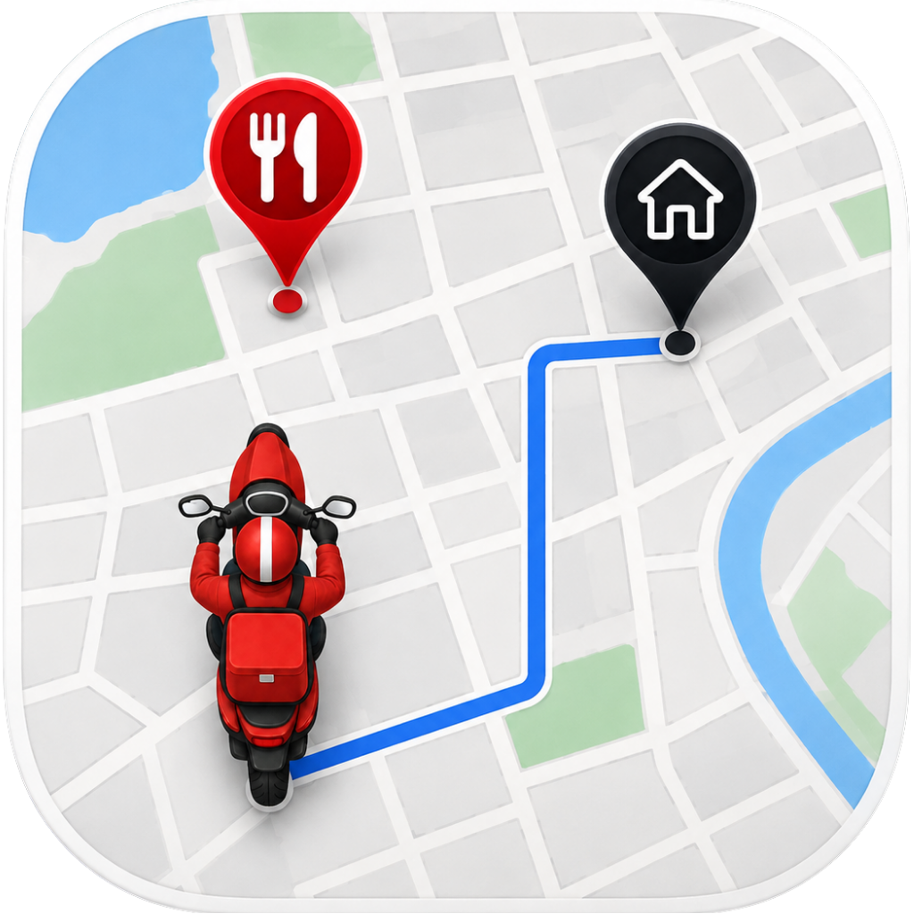
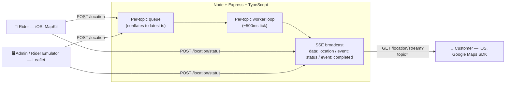

<p align="center">
  
</p>

<h1 align="center">Map Emulator</h1>

<p align="center">
  A hand-built simulation of how apps like Uber, Rapido, and Swiggy stream a moving rider's location to a customer's phone in real time — and make the dot glide, not jump.
</p>

<p align="center">
  
  
  
  
  
</p>

---

## Why this exists

Every ride-hailing and food-delivery app has the same trick at its core: a
producer sends raw GPS pings every second or two, and the consumer's map
shows a marker that _glides_ smoothly between them instead of teleporting.
I wanted to actually build that trick from scratch — not consume a library
that does it for me — end to end: the wire protocol, the backend plumbing
between "a location arrived" and "a client should see it," and the
client-side animation math that turns sparse points into motion.

This repo is the result: a **Node/Express/TypeScript backend** and a
**single SwiftUI iOS app with two roles** (Rider and Customer), built in
16 incremental phases, each one adding a real system-design or mobile-dev
concept on top of the last. It started as a weekend SSE experiment and grew
into a small but complete simulation of a location-tracking platform:
multi-tenant pub/sub, backpressure-aware queues, resilient reconnection,
and a full order-lifecycle state machine.

It's built to be read, not just run — see [How this was built](#how-this-was-built) for the process, and
[Build log](#build-log--phase-by-phase) for a phase-by-phase trail of the
design decisions, bugs, and concept checks behind every piece of it.

## Table of contents

- [Why this exists](#why-this-exists)
- [Table of contents](#table-of-contents)
- [How it works](#how-it-works)
- [Capabilities](#capabilities)
  - [📱 iOS app — Home, Rider, Customer](#-ios-app--home-rider-customer)
  - [🖥️ Admin / Rider Emulator (web)](#️-admin--rider-emulator-web)
  - [⚙️ Backend (Node + Express + TypeScript)](#️-backend-node--express--typescript)
- [Tech stack](#tech-stack)
- [Running it locally](#running-it-locally)
- [Project structure](#project-structure)
- [Build log — phase by phase](#build-log--phase-by-phase)
- [Stretch goals](#stretch-goals)
- [What I learned](#what-i-learned)
- [How this was built](#how-this-was-built)

## How it works

Two producers can post into the same named **topic**: the iOS Rider app
(MapKit) and a browser-based admin/emulator panel (Leaflet). Every topic
gets its own in-memory queue, worker loop, and set of SSE connections —
independent tenants sharing one process, the way a real Kafka-partitioned
system would isolate topics. The worker **conflates** the queue down to
the latest point roughly every 500ms before broadcasting, so a burst of
rapid updates doesn't overwhelm a slow consumer — a small, visible version
of the backpressure problem real streaming backends have to solve.



The Customer client speaks SSE with a **hand-rolled parser** over
`URLSession.bytes(for:)` — no third-party SSE library — because the point
was understanding the `event:`/`data:` framing, not hiding it behind a
dependency. Raw GPS pings then get **snapped onto the actual road-following
route** (via `MKDirections`) and animated between snapped points with
per-segment `CATransaction`s, adaptive duration, and great-circle bearing —
so the marker follows the road, U-turns included, instead of cutting a
straight line between two sparse points.

## Capabilities

### 📱 iOS app — Home, Rider, Customer

- **Home screen**: pick a topic name and a role (Rider or Customer); both
  sides must share the topic to see each other.
- **Rider** (MapKit): tap anywhere on the map to drop a pin and post that
  location into the topic. A sequential **status button bar** docked
  below the map (same completed / current / future states and arrows as
  the admin panel's) drives the order lifecycle directly from the app —
  no need to switch to the web panel to advance an order.
- **Customer** (Google Maps SDK):
  - Hand-rolled SSE client with exponential-backoff reconnect (capped
    retries, cancellation-safe, resets backoff on a clean reconnect).
  - Restaurant and home markers, with a decorative curved line between
    them before a rider is dispatched.
  - Rider marker "pops in" once dispatched, animates through a
    **route-snapped path** (not a straight line) with adaptive per-update
    duration and bearing-correct rotation, erasing the traveled polyline
    behind it as it goes.
  - Route target switches automatically — restaurant while inbound to
    pick up the order, home once it's picked up — recomputing on real
    drift _or_ on a destination change, not just blindly on every ping.
  - Dynamic camera framing (`GMSCoordinateBounds` + `GMSCameraUpdate.fit`)
    that keeps all relevant markers in view and narrows once the order is
    actually out for delivery.
  - A delivery-style status card (Zepto/Blinkit-inspired) that reflects
    the order's live lifecycle stage, and a distinct "delivered" signal
    that ends the stream cleanly instead of triggering a reconnect.

### 🖥️ Admin / Rider Emulator (web)

A Leaflet-based control panel, served statically by the backend, that
doubles as a second producer and a delivery-lifecycle control room:

- Click anywhere on the map to post a location into a topic — no Xcode
  rebuild needed to test the backend or the Customer client.
- **Low-Network Mode** toggle plus real `fetch`-failure detection queue
  location updates locally and flush the full backlog on reconnect —
  modeling the gap between "the network interface is up"
  (`navigator.onLine`) and "the backend is actually reachable."
- A sequential **status button bar** (Order Placed → Confirm Order →
  Rider → Restaurant → Picked Up → Delivered) drives the same order
  lifecycle the Customer app renders, with clear completed / current /
  future button states — the same bar the Rider iOS app now has, so
  either side can advance an order.

### ⚙️ Backend (Node + Express + TypeScript)

- `POST /location` — topic-scoped location ingestion.
- `POST /location/status` — advances a topic's order-lifecycle status;
  `delivered` is treated as terminal and closes the stream rather than
  becoming just another status frame.
- `GET /location/stream?topic=` — per-topic SSE subscription, multiplexing
  three named event types (`data:` location, `event: status`,
  `event: completed`) over one connection.
- Per-topic multi-tenancy: independent queue, worker, and connection set
  per topic, created lazily on first use.
- Graceful disconnect handling (`'error'` listeners, guarded writes,
  connections closed proactively — never relying on a client to cooperate
  for cleanup).

## Tech stack

| Layer              | Choice                                                            |
| ------------------ | ----------------------------------------------------------------- |
| Backend            | Node.js + Express + TypeScript, in-memory state only (no DB)      |
| Admin/control UI   | Static HTML/JS, Leaflet + OpenStreetMap (no API key)              |
| iOS client         | Single SwiftUI app, Swift 6, strict concurrency                   |
| Rider map          | Apple MapKit                                                      |
| Customer map       | Google Maps SDK for iOS                                           |
| Route computation  | `MKDirections` (CoreLocation service, SDK-independent either way) |
| Realtime transport | Server-Sent Events, hand-rolled on both ends                      |

## Running it locally

**Backend**

```bash
cd backend
npm install
npm run dev        # tsx watch, serves on http://localhost:3000
```

The admin/emulator panel is at `http://localhost:3000`.

**iOS app**

1. Open `ios-client/MapEmulatorClient/MapEmulatorClient.xcodeproj` in Xcode.
2. Copy `Secrets.swift.example` → `Secrets.swift` (gitignored) and fill in
   your own Google Maps API key.
3. In `LiveViewDataManager.swift`, point `BackendConfig.baseURL` at
   `http://localhost:3000` — the iOS Simulator shares the Mac's network
   stack, so no LAN IP or ngrok tunnel is needed for Simulator-only
   testing (an ngrok URL is only needed for a physical device).
4. Build and run. Enter the same topic on two instances (e.g. Simulator +
   the admin panel, or two Simulators) — one as Rider, one as Customer —
   to see updates flow end to end.

## Project structure

```
backend/
  src/
    server.ts         # Express app, routes
    TopicChannel.ts    # per-topic queue + worker + SSE fan-out + status/completion
    queue.ts           # DummyQueue — conflates to the latest item by ts
    services.ts        # topic registry (getOrCreateTopicChannel)
    types.d.ts          # LocationUpdate, StatusType
  public/
    index.html          # Leaflet admin / rider-emulator panel

ios-client/MapEmulatorClient/MapEmulatorClient/
  Views/
    HomeView.swift                     # role + topic selection
    RiderView.swift                    # MapKit producer
    CustomerView.swift                 # status card + navigation chrome
    GoogleMapsViewRepresentable.swift  # markers, route-snapped animation, camera framing
  ViewModels/
    RiderViewModel.swift
    LiveViewViewModel.swift            # rider location, status, MKDirections routing
  DataManagers/
    LiveViewDataManager.swift          # hand-rolled SSE client, retry/backoff
  Models/
    LocationUpdate.swift

docs/
  superpowers/specs/2026-07-02-live-location-tracking-emulator-design.md   # full design + phase table
  progress-log.md    # phase-by-phase code narrative, bugs found & fixed
  learning-log.md    # verbatim concept-quiz Q&A per phase
```

## Build log — phase by phase

Built in 16 phases, each ending in a concept quiz before moving on. Full
narrative in [docs/progress-log.md](docs/progress-log.md) (the code side)
and [docs/learning-log.md](docs/learning-log.md) (the concept side, verbatim
Q&A — including where my own understanding needed correcting).

| #   | Phase                         | What it covers                                                                                         |
| --- | ----------------------------- | ------------------------------------------------------------------------------------------------------ |
| 0   | Setup                         | Repo scaffolding, Express skeleton, Xcode project                                                      |
| 1   | SSE fundamentals              | Bare `/stream` endpoint, `text/event-stream` framing, verified with `curl`                             |
| 2   | Naive end-to-end pipe         | Control UI → `POST` → direct SSE broadcast, no queue yet                                               |
| 3   | Queue + rate-limited worker   | Decoupling producer from broadcast; conflation on an interval                                          |
| 4   | iOS client, no interpolation  | Hand-rolled SSE consumption on iOS; the marker-jump problem                                            |
| 5   | Route rendering               | `MKDirections` road-snapped polyline, recomputes past a drift threshold                                |
| 6   | App restructure               | Home screen, Rider/Customer navigation split                                                           |
| 7   | Backend multi-tenancy         | Per-topic queue/worker/connections, topic-scoped routes                                                |
| 8   | Rider client                  | MapKit tap-to-select, posts into a topic                                                               |
| 9   | Customer client + Google Maps | SDK swap, SSE subscribe by topic, route rendered as `GMSPolyline`                                      |
| 10  | Client-side interpolation     | Route-snapped `CATransaction` animation between GPS pings                                              |
| 11  | Realism upgrade               | Adaptive duration, bearing rotation, polyline erase, dynamic camera framing                            |
| 12  | Rider offline queueing        | Low-Network Mode + real failure detection, backlog flush on reconnect                                  |
| 13  | Resilience                    | Exponential-backoff SSE reconnect; graceful per-topic disconnect handling                              |
| 14  | Delivery completion           | Distinct `event: completed` signal, proactive server-side cleanup                                      |
| 15  | Order lifecycle state machine | `event: status` multiplexed over the same stream; restaurant marker, pickup routing, status button bar |

## Stretch goals

- ✅ **Dynamic camera framing** — pulled forward from the stretch list into
  Phase 11 once the per-segment animation machinery made it
  straightforward: the camera auto-fits to whichever markers and route
  are currently relevant, instead of a fixed zoom.
- ⏳ Not yet attempted: an "auto-drive-a-route" mode to stress-test
  interpolation with dense automatic updates, a full replay buffer for a
  reconnecting client to catch up on missed history (Phase 12 added a
  lighter version — replaying just the _last known state_ to a newly
  joining connection — but not a full backlog), and a topic
  list/discovery UI instead of free-text topic entry.

## What I learned

A few things that didn't click until I'd actually built them:

- **The SSE wire protocol is just text framing** — `data:` and
  `event:` lines separated by blank lines — but parsing it correctly
  means carrying state (the last seen `event:` name) _across_ iterations
  of a line-by-line read loop, since a named event's `event:` and `data:`
  lines arrive on separate reads.
- **A queue's job in a live-tracking system isn't durability, it's
  conflation** — keeping only the most recent point instead of every
  point, so a slow consumer or connection stall doesn't create a growing
  backlog of stale positions to catch up on.
- **Never make your own correctness depend on a remote party's
  cooperation.** The server closes connections and stops its own workers
  proactively when a topic is done, rather than trusting every client to
  notice a signal and disconnect politely — a lesson that came from a real
  bug where a client-side parsing mistake meant it never would have.
- **Interpolation is a pipeline, not a formula**: snap raw points onto a
  known route, slice the sub-path between two snapped points, split a
  total duration proportionally across that sub-path's segments, then
  chain one `CATransaction` per segment — linear interpolation alone gets
  you a smooth line, but not a marker that follows actual roads.
- **Multiplexing more than one signal over a single long-lived
  connection** (location pings, status changes, and a terminal completion
  signal, all over one `GET /location/stream`) needs an explicit,
  named-event design up front — an SSE stream isn't just a channel for
  one kind of message by default.
- **Swift 6's strict concurrency checking catches real races, not just
  style nits** — consuming `URLSession.bytes(for:)` inside a detached
  `Task` surfaced actor-isolation requirements I wouldn't have thought
  about writing the same code without the compiler enforcing it.

## How this was built

This project was built as a deliberate teaching engagement with Claude
Code, not a "generate the app for me" exercise: I wrote the
implementation for every phase myself, with Claude explaining the
concept for that phase and providing hints, boilerplate, or exact
library/API syntax only on request. Each phase ended in a concept quiz —
logged verbatim, including my raw (sometimes wrong) first answers and the
corrections — before moving on to the next one. That process is the
reason [docs/learning-log.md](docs/learning-log.md) and
[docs/progress-log.md](docs/progress-log.md) exist: they're a real trail
of what I understood, where I was wrong, and how the design evolved,
not a retroactively cleaned-up summary.
