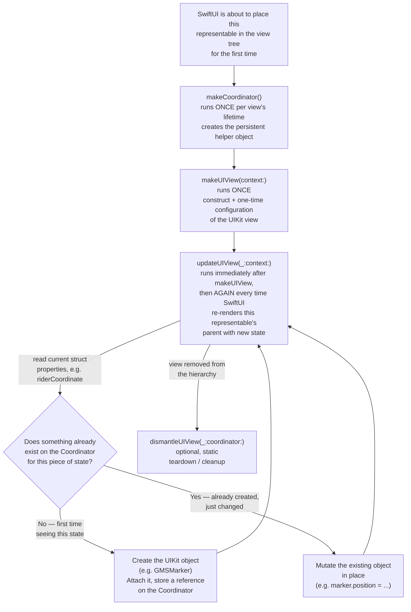

# `UIViewRepresentable` Lifecycle

How SwiftUI bridges to a persistent UIKit view, worked out against this
project's `GoogleMapsViewRepresentable` (wrapping `GMSMapView`, Phase 9),
but written to generalize to any future `UIViewRepresentable`/
`UIViewControllerRepresentable` you build.

## The core mental model

A `UIViewRepresentable` conformer is a **struct** — SwiftUI throws it away
and rebuilds a fresh value every time its parent's body re-runs, exactly
like any other SwiftUI view. But the UIKit object it wraps (`GMSMapView`
here) is **not** rebuilt each time — it's built once and then mutated in
place. The entire protocol exists to bridge those two lifetimes:

- **The struct's stored properties** = a snapshot of current SwiftUI state,
  handed to you fresh on every call.
- **The UIKit view** (returned by `makeUIView`) = persists across every
  update, mutated imperatively rather than redeclared.
- **The `Coordinator`** = the only other thing that persists across calls —
  the place for any mutable helper state (like "which marker did I already
  create") that isn't the UIKit view itself, and the conventional home for
  UIKit delegate conformances.

If you take nothing else from this: **the struct is stateless and disposable,
the UIView and the Coordinator are the two things with real lifetime.**

## Lifecycle flowchart



## What each requirement actually means

| Method | Called | How many times | What lives here |
|---|---|---|---|
| `makeCoordinator()` | Before the first `makeUIView` | Once, ever, for this view's lifetime | A reference type (`class`) holding whatever mutable state needs to survive across `updateUIView` calls — also the standard home for UIKit delegate conformances (e.g. `GMSMapViewDelegate`), since delegates need a stable reference, not a fresh struct each time |
| `makeUIView(context:)` | Once, right after `makeCoordinator()` | Once | Construct the UIKit view and any **one-time** setup that shouldn't repeat — initial camera, static config. Returns the view SwiftUI will keep reusing |
| `updateUIView(_:context:)` | Immediately after `makeUIView`, then again on every re-render | Many — once per relevant state change | The actual sync logic: read the struct's current properties, compare against what the Coordinator says already exists, and imperatively mutate the UIKit view to match. **This is where the "is this the first time or an update?" branch belongs** |
| `dismantleUIView(_:coordinator:)` | When the view leaves the hierarchy | Once (optional to implement) | Teardown — remove observers, invalidate timers, anything that would otherwise leak once the UIKit view is discarded |

## Walked through this project's case

```
makeCoordinator()
  → MapCoordinator() created, var marker: GMSMarker? = nil

makeUIView(context:)
  → GMSMapView() constructed
  → camera set once to homeCoordinate at zoom 14
  → returned to SwiftUI, which holds onto this exact instance

updateUIView(_:context:)   [first call, right after makeUIView]
  → riderCoordinate is still nil (no SSE update has arrived yet)
  → guard let riderCoordinate else { return } — no-op

  ... an SSE update arrives, viewModel.riderLocation changes,
  CustomerView's body re-runs, a fresh GoogleMapsViewRepresentable
  value is built with the new riderCoordinate ...

updateUIView(_:context:)   [second call]
  → riderCoordinate is now non-nil
  → context.coordinator.marker is nil → the "create" branch:
      build a GMSMarker, marker.map = uiView, store it on the coordinator

  ... another SSE update arrives ...

updateUIView(_:context:)   [third call, and every call after]
  → context.coordinator.marker already exists → the "move" branch:
      marker.position = riderCoordinate
```

The same shape will apply to the Phase 9 polyline work next: `updateUIView`
checks whether a `GMSPolyline` already exists on the coordinator, replaces
its `path` if so, creates + attaches it if not — identical pattern, just a
different piece of state and a different Coordinator property.
